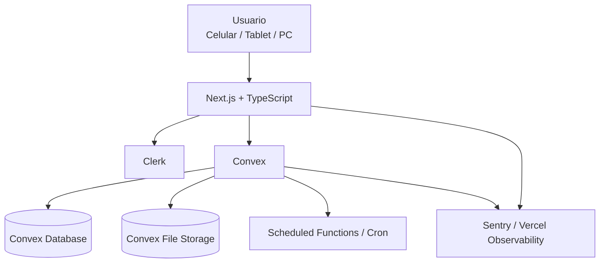
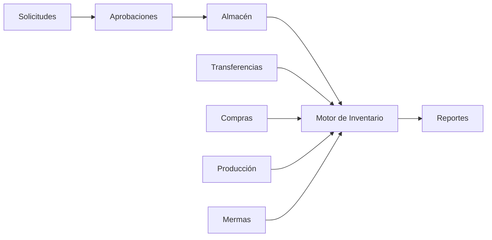
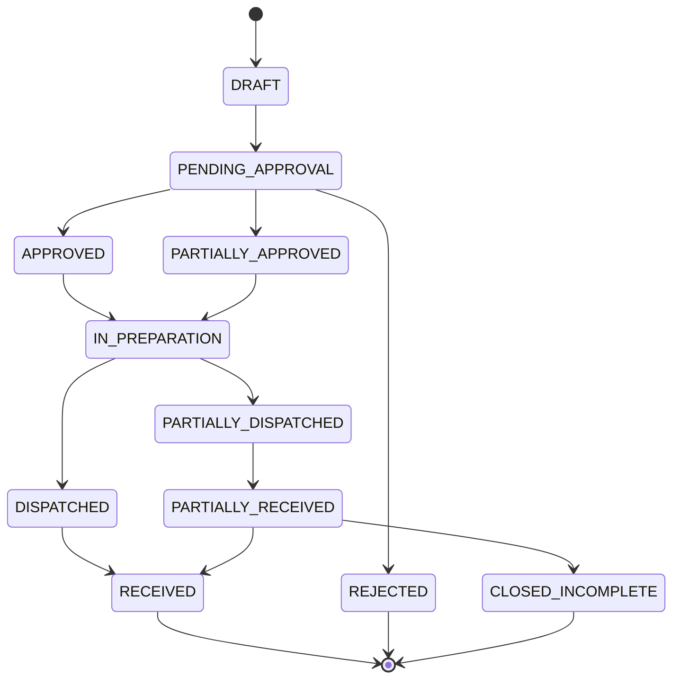
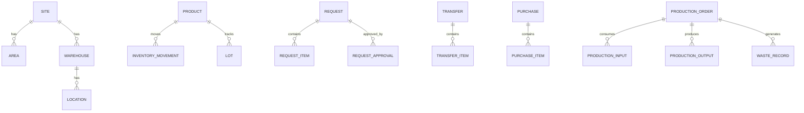

# PRD Técnico V1.0  
## Sistema de Solicitudes, Abastecimiento, Inventario y Producción

**Cliente:** Juan Vila  
**Versión:** 1.0  
**Fecha:** Agosto 2026  
**Estado:** Borrador técnico para desarrollo  
**Incluye:** Producción Básica en Fase 1  
**Stack oficial:** Next.js + TypeScript + Convex + Clerk + Tailwind CSS + shadcn/ui + Base UI + Vercel

---

## 1. Propósito

Este documento define el alcance funcional y técnico de la primera versión del aplicativo para la gestión de solicitudes internas, aprobaciones, abastecimiento, inventario, transferencias entre sedes, compras, vencimientos, producción básica, mermas y reportes.

El objetivo principal es reemplazar progresivamente procesos manuales realizados mediante papel, mensajería y coordinación verbal, reduciendo errores y mejorando la trazabilidad operativa.

---

## 2. Objetivos del producto

### 2.1 Objetivos de negocio

- Centralizar las solicitudes internas de insumos y productos.
- Reducir el uso de papel.
- Disminuir errores en productos, cantidades y unidades de medida.
- Controlar stock por sede, almacén y ubicación.
- Dar trazabilidad a solicitudes, aprobaciones, despachos y recepciones.
- Controlar transferencias entre San Miguel y Lince.
- Registrar compras e ingresos de almacén.
- Controlar lotes y fechas de vencimiento cuando corresponda.
- Priorizar productos próximos a vencer.
- Registrar producción y transformación de materias primas.
- Registrar mermas y desperdicios.
- Brindar información resumida a Gerencia.
- Mantener el sistema sencillo, intuitivo y ágil.

### 2.2 Objetivos técnicos

- Mantener una única fuente de verdad para movimientos de inventario.
- Proveer actualización de información en tiempo real.
- Mantener trazabilidad completa de operaciones críticas.
- Evitar doble descuento o duplicidad de movimientos de stock.
- Implementar control de acceso por rol, sede y área.
- Diseñar el dominio de Producción desde Fase 1.
- Permitir crecimiento posterior sin rediseñar el núcleo de inventario.

---

# 3. Alcance de Fase 1

La Fase 1 incluye:

1. Autenticación.
2. Usuarios, roles y permisos.
3. Sedes.
4. Áreas.
5. Almacenes y ubicaciones.
6. Catálogo de productos e insumos.
7. Categorías y subcategorías.
8. Unidades de medida.
9. Catálogos autorizados por área.
10. Solicitudes internas.
11. Solicitudes extraordinarias.
12. Solicitudes urgentes.
13. Aprobaciones.
14. Preparación de pedidos.
15. Despachos.
16. Entregas parciales.
17. Recepción.
18. Incidencias.
19. Inventario.
20. Entradas de almacén.
21. Transferencias entre sedes.
22. Proveedores.
23. Compras / abastecimiento.
24. Listas de precios.
25. Lotes.
26. Vencimientos.
27. FEFO.
28. Producción básica.
29. Transformación de productos.
30. Mermas.
31. Presupuestos como alertas.
32. Reportes operativos.
33. Dashboard gerencial.
34. Auditoría.
35. Archivos y evidencias.
36. Notificaciones internas.
37. PWA responsive para celular, tablet y desktop.

---

# 4. Fuera de alcance de Fase 1

Salvo cambio formal de alcance, no se considera inicialmente:

- Contabilidad completa.
- Facturación electrónica.
- POS.
- Gestión de mesas.
- Gestión de reservas.
- Planillas.
- CRM.
- Sistema completo de recetas gastronómicas.
- Costeo avanzado por plato.
- Pronóstico automático de demanda.
- Inteligencia artificial para compras.
- Optimización automática de proveedores.
- App nativa Android.
- App nativa iOS.
- Integración directa con SUNAT.
- Integración contable externa.
- Ruteo logístico avanzado.

Estas funcionalidades podrán evaluarse como fases posteriores.

---

# 5. Sedes y estructura operativa

## 5.1 Sedes iniciales

- San Miguel.
- Lince.

## 5.2 San Miguel

San Miguel tendrá funciones adicionales:

- Almacén principal.
- Almacén de abarrotes.
- Cámara de frío.
- Congeladoras.
- Área de Producción.
- Capacidad de abastecer a Lince.

## 5.3 Lince

Lince contará con:

- Almacén de abarrotes.
- Conservadoras.
- Congeladoras.
- Recepción de productos desde San Miguel.
- Recepción directa de proveedores cuando corresponda.

## 5.4 Principio de inventario

El stock no será un atributo simple del producto.

El sistema deberá manejar:

```text
Producto
+ Sede
+ Almacén
+ Ubicación
+ Lote (cuando corresponda)
= Existencia
```

---

# 6. Stack tecnológico oficial

## 6.1 Frontend

- Next.js.
- React.
- TypeScript.
- App Router.
- Tailwind CSS.
- shadcn/ui.
- Base UI.
- Lucide Icons.
- React Hook Form.
- Zod.
- TanStack Table.
- Recharts.

## 6.2 Backend

- Convex.
- Convex Database.
- Convex Queries.
- Convex Mutations.
- Convex Actions.
- Convex Scheduled Functions.
- Convex Cron Jobs.
- Convex File Storage.

## 6.3 Autenticación

- Clerk.

## 6.4 Autorización

- RBAC personalizado almacenado en Convex.

## 6.5 Hosting y despliegue

- Vercel.

## 6.6 Repositorio

- GitHub.

## 6.7 Testing

- Vitest.
- React Testing Library.
- Playwright.

## 6.8 Observabilidad

- Sentry.
- Vercel Observability.
- Convex Logs.

---

# 7. Arquitectura general



Convex será la fuente principal de datos operativos.

No se añadirá una segunda base de datos en Fase 1.

---

# 8. Arquitectura funcional



## 8.1 Principio técnico central

Todo cambio de stock deberá pasar por un **motor de movimientos de inventario**.

No se deberá modificar el stock mediante actualizaciones arbitrarias.

Ejemplos:

```text
Compra:
+10 unidades

Despacho:
-5 unidades

Transferencia:
-5 San Miguel
+5 Lince después de recepción

Producción:
-10 materia prima
+20 producto resultante

Merma:
registro de pérdida según etapa
```

---

# 9. Usuarios, roles y RBAC

## 9.1 Roles iniciales

- GERENCIA
- ADMINISTRACION
- CHEF_EJECUTIVA
- JEFE_COCINA
- JEFE_SALON
- JEFE_BAR
- ALMACEN
- PRODUCCION
- RESPONSABLE_AREA
- SOLICITANTE

## 9.2 Modelo RBAC

El sistema deberá separar:

### Identidad

Gestionada por Clerk:

- login;
- contraseña;
- sesión;
- recuperación;
- seguridad de autenticación.

### Perfil de negocio

Gestionado por Convex:

- sede;
- área;
- rol;
- permisos;
- catálogos disponibles;
- alcance de aprobación.

## 9.3 Ejemplo de permisos

```text
requests.create
requests.read
requests.approve
requests.reject
requests.modify_approved_quantity

inventory.read
inventory.receive
inventory.transfer
inventory.adjust

purchases.create
purchases.receive
purchases.view_costs

production.create
production.start
production.complete
production.register_waste

reports.read
reports.costs.read

master.products.manage
master.suppliers.manage
master.users.manage
```

## 9.4 Alcance

Un permiso podrá limitarse por:

- sede;
- área;
- almacén;
- tipo de operación.

Ejemplo:

```text
Chef Ejecutiva
- puede aprobar Cocina San Miguel
- puede aprobar Cocina Lince
- puede visualizar costos autorizados
- no necesariamente administra usuarios
```

---

# 10. Catálogo de productos

## 10.1 Categorías iniciales

- Abarrotes.
- Proteínas.
- Carnes.
- Suministros.
- Artículos de oficina.
- Limpieza.
- Bebidas.
- Descartables.
- Verduras.
- Frutas.
- Gas.
- Otras configurables.

## 10.2 Producto

Cada producto deberá soportar:

```text
Código
Nombre
Categoría
Subcategoría
Presentación
Unidad de medida
Marca opcional
Estado activo/inactivo
Maneja lote
Maneja vencimiento
Permite sustitución
Fotografía opcional
Observaciones
```

## 10.3 Catálogo por área

No todas las áreas tendrán acceso a todos los productos.

Relación:

```text
Área
<-> Productos autorizados
```

Usuarios de rango superior podrán acceder a más de un catálogo.

---

# 11. Unidades de medida

Las unidades de medida serán configurables.

Ejemplos:

- Unidad.
- Caja.
- Bolsa.
- Paquete.
- Botella.
- Kg.
- Gramo.
- Litro.
- Mililitro.

Cada unidad deberá soportar:

```text
name
symbol
allowsDecimals
decimalPrecision
active
```

Ejemplo:

```text
Unidad
allowsDecimals = false

Caja
allowsDecimals = false

Kg
allowsDecimals = true
decimalPrecision = 3

Litro
allowsDecimals = true
decimalPrecision = 3
```

La validación deberá realizarse tanto en frontend como en backend.

---

# 12. Horarios de solicitud

El horario será configurable.

Configuración sugerida:

```text
siteId
regularRequestStartTime
regularRequestEndTime
outOfScheduleBehavior
```

Comportamiento fuera de horario:

1. La solicitud no será bloqueada.
2. Se marcará como fuera de horario.
3. Podrá convertirse en urgente.
4. Deberá registrar motivo.
5. Podrá requerir autorización adicional según configuración.

---

# 13. Solicitudes internas

## 13.1 Flujo principal


## 13.2 Cabecera

Una solicitud deberá registrar:

```text
requestNumber
siteId
areaId
requestedBy
requiredDate
shift
priority
outOfSchedule
urgentReason
notes
status
createdAt
```

## 13.3 Detalle

Cada ítem:

```text
productId
requestedQuantity
unitId
approvedQuantity
fulfilledQuantity
pendingQuantity
itemStatus
approvalComment
```

---

# 14. Estados de solicitud

Estados sugeridos:

```text
DRAFT
PENDING_APPROVAL
PARTIALLY_APPROVED
APPROVED
REJECTED
IN_PREPARATION
PARTIALLY_DISPATCHED
DISPATCHED
PARTIALLY_RECEIVED
RECEIVED
OBSERVED
CLOSED_INCOMPLETE
CANCELLED
```



---

# 15. Aprobaciones

## 15.1 Responsables

Configuración inicial:

```text
Cocina -> Chef Ejecutiva
Salón -> Jefe de Salón / Administración
Bar -> Jefe de Bar
Administración -> Administración / Gerencia
```

Si el aprobador no está disponible:

```text
Aprobador principal
-> superior
-> Gerencia
```

## 15.2 Nivel de aprobación

La aprobación será por:

```text
Producto + cantidad
```

El aprobador podrá:

- aprobar;
- reducir cantidad;
- modificar cantidad;
- observar;
- rechazar.

Cuando modifique cantidad o rechace:

```text
motivo obligatorio
```

---

# 16. Solicitudes extraordinarias

Cuando el producto no exista en el catálogo:

```text
Tipo: EXTRAORDINARY
Nombre temporal
Cantidad
Unidad
Motivo
Fecha requerida
Área
Solicitante
```

Requerirá aprobación.

Si el producto vuelve a ser solicitado:

```text
Responsable de área
-> propone incorporación
-> Administración / Gerencia valida
-> se crea producto maestro
```

---

# 17. Solicitudes urgentes

Una solicitud urgente deberá:

```text
priority = URGENT
urgentReason = obligatorio
```

No tendrá un flujo completamente separado.

Deberá:

- aparecer destacada;
- generar notificación;
- mantener aprobación;
- quedar registrada para auditoría.

---

# 18. Preparación de pedidos

Almacén deberá disponer de una bandeja con solicitudes:

- aprobadas;
- urgentes;
- pendientes;
- parcialmente preparadas.

Cada ítem podrá marcarse como:

```text
PENDING
PREPARED
PARTIALLY_PREPARED
NOT_AVAILABLE
SUBSTITUTED
```

Un sustituto deberá:

- identificar producto original;
- identificar producto sustituto;
- registrar motivo;
- informar al receptor.

---

# 19. Entregas parciales

Una solicitud podrá tener múltiples entregas.

Ejemplo:

```text
Solicitado: 20 kg
Entrega 1: 12 kg
Entrega 2: 5 kg
Entrega 3: 3 kg
```

Se deberá mantener:

```text
requested
approved
dispatched
received
pending
```

Si el solicitante decide que el saldo ya no es necesario:

```text
CLOSED_INCOMPLETE
closedBy
closedReason
closedAt
```

---

# 20. Recepción

Estados por entrega:

- Conforme.
- Observada.
- Rechazada.

La recepción podrá validar:

```text
Cantidad
Peso
Estado
Producto
Lote
Vencimiento
Observación
```

Motivos sugeridos:

- cantidad incorrecta;
- peso incorrecto;
- producto incorrecto;
- producto dañado;
- vencido;
- calidad no conforme;
- otro.

Incidencias podrán notificar a:

- Almacén.
- Administración.
- Chef Ejecutiva.
- Gerencia.

---

# 21. Motor de inventario

## 21.1 Inventory Ledger

Se recomienda implementar un libro mayor de inventario append-only.

Cada movimiento deberá crear un registro.

Nunca se deberá depender únicamente de un campo mutable `stock`.

## 21.2 Tipos de movimientos

```text
PURCHASE_RECEIPT
WAREHOUSE_ENTRY
INTERNAL_DISPATCH
INTERNAL_RECEIPT
TRANSFER_OUT
TRANSFER_IN
PRODUCTION_CONSUMPTION
PRODUCTION_OUTPUT
WASTE
RETURN
ADJUSTMENT_POSITIVE
ADJUSTMENT_NEGATIVE
REVERSAL
```

## 21.3 Movimiento

```text
movementId
movementType
productId
quantity
unitId
siteId
warehouseId
locationId
lotId?
referenceType
referenceId
createdBy
createdAt
reason?
reversalOf?
```

## 21.4 Stock calculado

Conceptualmente:

```text
Stock = SUM(movimientos válidos)
```

Puede mantenerse una tabla/materialización de balance para lectura rápida, pero el ledger será la fuente auditable.

---

# 22. Entradas de almacén

Información base aprobada:

```text
Producto / insumo
Cantidad
Unidad
Fecha de ingreso
Sede
Almacén / ubicación
Origen
Observación
```

Campos condicionales:

## Compra

```text
Proveedor
Precio unitario
Comprobante / documento
```

## Producto con trazabilidad

```text
Lote
Fecha de vencimiento
```

Campos automáticos:

```text
Usuario
Fecha
Hora
Historial
```

Orígenes sugeridos:

```text
SUPPLIER
TRANSFER
RETURN
INITIAL_STOCK
ADJUSTMENT
OTHER
```

---

# 23. Modificación y anulación de entradas

Almacén y Administración podrán registrar.

Modificar o anular requerirá autorización de:

- Administración.
- Gerencia.

Una entrada confirmada no deberá eliminarse físicamente.

Se deberá generar:

```text
reversal / correction
```

y guardar:

```text
requestedBy
authorizedBy
reason
timestamp
originalMovementId
```

---

# 24. Transferencias entre sedes

## 24.1 Flujo


## 24.2 Regla crítica

El destino no incrementará su stock disponible hasta confirmar:

- cantidad;
- peso cuando aplique;
- estado del producto.

## 24.3 Transferencia inversa

El modelo deberá permitir:

```text
San Miguel -> Lince
Lince -> San Miguel
```

---

# 25. Compras y abastecimiento

Cuando no exista stock suficiente podrá generarse una necesidad de compra.

Flujo inicial:

```text
Solicitud
-> falta stock
-> necesidad de compra
-> proveedor
-> compra
-> recepción
-> entrada de almacén
```

## 25.1 Compra

```text
purchaseNumber
supplierId
siteId
requestedBy
approvedBy
status
expectedDate
notes
```

## 25.2 Detalle

```text
productId
quantity
unitId
unitPrice
receivedQuantity
pendingQuantity
```

---

# 26. Proveedores

Proveedor:

```text
name
documentNumber?
contactName?
phone?
email?
active
notes
```

No todos los datos deberán ser obligatorios en Fase 1.

---

# 27. Listas de precios

Los proveedores pueden enviar listas actualizadas periódicamente.

Se deberá almacenar:

```text
supplierId
productId
price
currency
validFrom
validTo?
createdAt
```

Costo operativo base:

```text
último precio de compra
```

Los perfiles autorizados a visualizar costos:

- Gerencia.
- Administración.
- Chef Ejecutiva.
- Almacén.

---

# 28. Presupuesto por área

El presupuesto no bloqueará automáticamente una solicitud.

Funcionará como:

```text
Indicador
Alerta
Reporte
```

Ejemplo:

```text
Presupuesto Cocina Agosto: S/ 10,000
Consumo acumulado: S/ 9,200

Estado: ALERTA
```

El sistema podrá permitir continuar porque el incremento puede estar relacionado con mayor demanda.

---

# 29. Lotes y vencimientos

Un producto podrá configurarse como:

```text
tracksLot = true / false
tracksExpiry = true / false
```

Lote:

```text
lotNumber
productId
receivedQuantity
remainingQuantity
receivedAt
expiresAt
supplierId?
```

---

# 30. FEFO

Para productos con vencimiento, la política recomendada será:

**First Expired, First Out.**

El sistema deberá:

- ordenar lotes por fecha de vencimiento;
- sugerir primero el lote con vencimiento más próximo;
- mostrar alertas;
- permitir excepción autorizada cuando corresponda.

No se deberá confundir FEFO con FIFO.

---

# 31. Producción Básica

Producción forma parte de la arquitectura de Fase 1.

El objetivo es registrar transformación de materias primas en productos procesados o semielaborados.

Ejemplo:

```text
Materia prima:
50 pollos enteros

Producción:
despiece

Resultados:
pechugas
piernas
encuentros

Merma:
cantidad registrada
```

---

# 32. Orden de producción

## 32.1 Cabecera

```text
productionOrderNumber
siteId
productionAreaId
plannedDate
shift?
status
createdBy
startedBy?
completedBy?
notes
```

## 32.2 Estados

```text
DRAFT
PLANNED
IN_PROGRESS
COMPLETED
CANCELLED
```

---

# 33. Insumos de producción

Cada orden podrá registrar múltiples consumos:

```text
productId
lotId?
plannedQuantity?
actualQuantity
unitId
warehouseId
locationId
```

Al confirmar consumo:

```text
movementType = PRODUCTION_CONSUMPTION
```

---

# 34. Productos resultantes

Cada orden podrá generar uno o varios productos:

```text
outputProductId
quantity
unitId
destinationWarehouseId
destinationLocationId
lotNumber?
expiresAt?
```

Al completar:

```text
movementType = PRODUCTION_OUTPUT
```

---

# 35. Rendimiento de producción

Fase 1 podrá registrar:

```text
totalInputQuantity
totalOutputQuantity
wasteQuantity
yieldPercentage
```

Ejemplo:

```text
Entrada: 20 kg
Producto aprovechable: 17.5 kg
Merma: 2.5 kg
Rendimiento: 87.5%
```

No se considera inicialmente costeo gastronómico avanzado.

---

# 36. Mermas

La merma podrá registrarse en:

- almacenamiento;
- producción;
- preparación/cocina;
- servicio;
- devolución;
- otras etapas configurables.

Campos:

```text
productId
quantity
unitId
cause
areaId
siteId
warehouseId?
locationId?
productionOrderId?
responsibleUserId
evidenceFileId?
authorizationUserId?
occurredAt
notes
```

---

# 37. Regla de doble descuento de merma

Esta regla es crítica.

Si el producto ya salió del almacén hacia Producción:

```text
Almacén:
-20 kg

Producción recibe:
20 kg

Resultado:
17 kg útil
3 kg merma
```

No se deberá volver a descontar `3 kg` del mismo stock del almacén.

La merma deberá asociarse al contexto donde ya existe el consumo.

El modelo deberá distinguir:

```text
merma que consume stock disponible
vs.
merma analítica sobre material ya consumido
```

---

# 38. Reportes

## 38.1 Gerencia

- stock general;
- stock por sede;
- stock por almacén;
- stock por ubicación;
- solicitudes por estado;
- tiempos de atención;
- consumo por sede;
- consumo por área;
- compras;
- variación de precios;
- productos próximos a vencer;
- mermas;
- transferencias;
- producción;
- rendimiento de producción;
- alertas presupuestales.

## 38.2 Periodicidad

- semanal;
- mensual;
- rango personalizado.

## 38.3 Exportación

Fase 1 deberá contemplar exportación a:

- Excel/CSV.

PDF podrá evaluarse según necesidad.

---

# 39. Dashboard

Indicadores sugeridos:

```text
Solicitudes pendientes
Solicitudes urgentes
Pedidos observados
Pedidos por preparar
Stock crítico
Productos próximos a vencer
Compras pendientes
Transferencias en tránsito
Producciones en curso
Merma del periodo
```

Gráficos:

- consumo por sede;
- consumo por área;
- compras por categoría;
- merma por área;
- variación de precios;
- producción por periodo.

---

# 40. Notificaciones

Fase 1 priorizará notificaciones internas.

Eventos:

```text
Nueva solicitud
Solicitud pendiente de aprobación
Solicitud aprobada
Solicitud rechazada
Solicitud urgente
Pedido listo
Despacho realizado
Recepción observada
Transferencia pendiente de recepción
Stock crítico
Producto próximo a vencer
Compra pendiente
Producción completada
```

Correo y WhatsApp podrán evaluarse como integración posterior.

---

# 41. Archivos

Archivos esperados:

- comprobantes;
- guías;
- fotografías de productos;
- evidencias de merma;
- evidencias de incidencias.

Fase 1:

```text
Convex File Storage
```

El acceso a archivos deberá pasar por reglas de autorización.

---

# 42. Auditoría

Operaciones críticas deberán registrar:

```text
userId
action
entityType
entityId
before?
after?
reason?
authorizedBy?
createdAt
```

Eventos auditables mínimos:

- aprobación;
- rechazo;
- cambio de cantidad;
- entrada de almacén;
- modificación de entrada;
- anulación;
- transferencia;
- recepción;
- ajuste de inventario;
- cierre incompleto;
- producción;
- merma.

---

# 43. Modelo de datos propuesto en Convex

Colecciones sugeridas:

```text
users
roles
permissions
rolePermissions
userScopes

sites
areas
warehouses
locations

categories
subcategories
units
products
productAreaAccess

suppliers
supplierPrices

requests
requestItems
requestApprovals

dispatches
dispatchItems
receipts
receiptItems
incidents

inventoryMovements
inventoryBalances
lots

transfers
transferItems

purchases
purchaseItems

productionOrders
productionInputs
productionOutputs
wasteRecords

budgets

notifications
auditLogs
files
settings
```

---

# 44. Esquema conceptual de entidades



---

# 45. Índices recomendados en Convex

Ejemplos conceptuales:

```text
requests:
- by_site_status
- by_area_status
- by_requester
- by_required_date

inventoryMovements:
- by_product_site
- by_product_location
- by_reference
- by_created_at

lots:
- by_product_location
- by_expiry

transfers:
- by_origin_status
- by_destination_status

purchases:
- by_supplier_status
- by_site_status

productionOrders:
- by_site_status
- by_date
```

Los índices definitivos deberán definirse según los patrones reales de consulta.

---

# 46. Convex Queries

Responsabilidades:

- lectura;
- filtros;
- dashboards;
- bandejas;
- stock;
- reportes;
- listas.

Ejemplos:

```text
requests.listForUser
requests.getById
approvals.listPending
inventory.getStock
inventory.listLots
transfers.listPendingReceipt
production.listActive
reports.dashboard
```

---

# 47. Convex Mutations

Responsabilidades:

- cambios consistentes;
- validación;
- permisos;
- movimientos.

Ejemplos:

```text
requests.create
requests.submit
requests.approveItem
requests.rejectItem

inventory.receiveEntry
inventory.adjust

dispatches.create
receipts.confirm

transfers.dispatch
transfers.receive

production.createOrder
production.start
production.complete

waste.create
```

Toda mutation crítica deberá validar autorización en backend.

---

# 48. Convex Actions

Se utilizarán principalmente para integración externa o tareas no transaccionales.

Ejemplos futuros:

- correo;
- WhatsApp;
- generación avanzada de documentos;
- integración con APIs externas.

No deberán usarse innecesariamente para operaciones que puedan resolverse con mutations.

---

# 49. Scheduled Functions y Cron

Casos:

## Vencimientos

```text
Diario
-> buscar productos próximos a vencer
-> generar alertas
```

## Solicitudes pendientes

```text
Cada cierto intervalo
-> identificar solicitudes sin atención
-> notificar
```

## Stock crítico

```text
Evaluación periódica
-> generar alertas
```

---

# 50. Frontend: estructura sugerida

```text
app/
  (auth)/
  (dashboard)/
    dashboard/
    requests/
    approvals/
    warehouse/
    inventory/
    transfers/
    purchases/
    production/
    waste/
    suppliers/
    reports/
    settings/
```

---

# 51. Estructura de dominio sugerida

```text
src/
  components/
  features/
    requests/
    approvals/
    inventory/
    warehouse/
    transfers/
    purchases/
    production/
    waste/
    reports/
  lib/
  hooks/
  validators/
  types/
```

Convex:

```text
convex/
  schema.ts
  auth.config.ts
  users.ts
  requests.ts
  approvals.ts
  inventory.ts
  transfers.ts
  purchases.ts
  production.ts
  waste.ts
  suppliers.ts
  reports.ts
  scheduled.ts
  lib/
```

---

# 52. Validaciones

## Frontend

React Hook Form + Zod.

Objetivo:

- feedback inmediato;
- mensajes claros;
- formularios ágiles.

## Backend

Convex deberá repetir validaciones críticas.

Nunca se confiará únicamente en el frontend.

Ejemplos:

```text
quantity > 0

unit.allowsDecimals = false
-> cantidad entera

product.tracksExpiry = true
-> expiresAt obligatorio al recibir

origin = SUPPLIER
-> supplierId obligatorio

urgent = true
-> urgentReason obligatorio
```

---

# 53. Seguridad

## 53.1 Autenticación

Clerk.

## 53.2 Autorización

Cada query/mutation sensible deberá verificar:

```text
usuario autenticado
rol
permiso
scope
sede
área
```

## 53.3 Seguridad de costos

Costos visibles únicamente para perfiles autorizados.

## 53.4 Seguridad de archivos

Las URLs de archivos no deberán tratarse como autorización.

Se deberá controlar el acceso desde la aplicación.

---

# 54. PWA

La primera versión será una aplicación web responsive y PWA.

Objetivos:

- instalar desde navegador;
- acceso desde pantalla de inicio;
- experiencia similar a app;
- una sola base de código;
- uso en Android, iOS, tablet y PC.

No se desarrollará app nativa inicialmente.

---

# 55. Mobile First

Prioridad de diseño:

1. Tablet.
2. Celular.
3. Desktop.

Principios:

- botones grandes;
- pocos pasos;
- búsquedas rápidas;
- favoritos/frecuentes;
- evitar formularios extensos;
- mostrar campos condicionalmente;
- lenguaje de negocio.

---

# 56. Requisitos no funcionales

## Rendimiento

Objetivos iniciales:

- navegación percibida rápida;
- consultas frecuentes optimizadas;
- bandejas paginadas;
- búsqueda eficiente.

## Disponibilidad

El sistema dependerá de:

- Vercel;
- Convex;
- Clerk.

## Compatibilidad

Últimas versiones estables de:

- Chrome;
- Edge;
- Safari;
- navegadores móviles.

## Accesibilidad

Se procurará:

- contraste adecuado;
- navegación con teclado;
- labels;
- estados visibles.

---

# 57. Observabilidad

## Sentry

- errores frontend;
- errores runtime;
- contexto de excepción.

## Vercel

- métricas de aplicación;
- rendimiento;
- logs disponibles.

## Convex

- logs de funciones;
- errores de queries/mutations/actions.

---

# 58. Testing

## Unitario

Vitest.

Áreas críticas:

- unidades de medida;
- estados;
- cálculos;
- permisos;
- reglas de stock.

## Componentes

React Testing Library.

## E2E

Playwright.

Flujos obligatorios:

### Solicitud

```text
crear
-> aprobar
-> preparar
-> despachar
-> recibir
```

### Compra

```text
crear
-> recibir
-> ingresar stock
```

### Transferencia

```text
despachar origen
-> tránsito
-> confirmar destino
```

### Producción

```text
consumir insumo
-> generar producto
-> registrar merma
-> validar stock
```

---

# 59. Casos críticos de prueba

1. Solicitud con producto no autorizado.
2. Solicitud urgente sin motivo.
3. Solicitud fuera de horario.
4. Aprobador modifica cantidad sin motivo.
5. Entrega parcial.
6. Cierre incompleto.
7. Recepción observada.
8. Transferencia rechazada.
9. Lote vencido.
10. FEFO.
11. Unidad que no permite decimal.
12. Unidad que permite decimal.
13. Entrada anulada.
14. Compra parcial.
15. Producción con múltiples outputs.
16. Merma sin doble descuento.
17. Usuario intentando acceder a otra sede.
18. Usuario sin permiso para visualizar costos.
19. Reintento de una operación crítica.
20. Reverso de movimiento.

---

# 60. Importación inicial

El maestro actual de Google Sheets podrá utilizarse como base.

Proceso:

```text
Exportación
-> validación
-> limpieza
-> mapeo
-> preview
-> importación
```

Validaciones:

- códigos duplicados;
- unidades desconocidas;
- categorías;
- productos inactivos;
- presentaciones;
- sedes;
- áreas.

---

# 61. Datos iniciales

Antes del piloto se deberá cargar:

- sedes;
- áreas;
- almacenes;
- ubicaciones;
- usuarios;
- roles;
- productos;
- unidades;
- categorías;
- accesos por área;
- proveedores;
- stock inicial;
- lotes iniciales si aplica.

---

# 62. Implementación

## Fase de desarrollo estimada

Con Producción Básica incluida:

**9 a 12 semanas**, sujeto a:

- disponibilidad de información;
- validaciones del cliente;
- cambios de alcance;
- complejidad final de Producción;
- calidad del maestro inicial.

---

# 63. Cronograma técnico preliminar

## Semana 1

- arquitectura;
- proyecto;
- auth;
- schema inicial;
- sedes;
- áreas;
- roles;
- usuarios.

## Semana 2

- productos;
- categorías;
- unidades;
- catálogos por área;
- importación inicial.

## Semana 3

- solicitudes;
- horarios;
- urgencias;
- extraordinarios.

## Semana 4

- aprobaciones;
- bandejas;
- estados.

## Semana 5

- inventario;
- almacenes;
- ubicaciones;
- entradas.

## Semana 6

- despachos;
- entregas parciales;
- recepción;
- incidencias.

## Semana 7

- transferencias;
- lotes;
- vencimientos;
- FEFO.

## Semana 8

- proveedores;
- listas de precios;
- compras.

## Semana 9

- Producción Básica;
- inputs;
- outputs.

## Semana 10

- mermas;
- rendimiento;
- reportes.

## Semana 11

- dashboards;
- auditoría;
- PWA;
- pruebas.

## Semana 12

- piloto;
- estabilización;
- correcciones;
- despliegue.

El cronograma podrá comprimirse o extenderse según resultados del desarrollo y validaciones.

---

# 64. Estrategia de despliegue

Ambientes:

```text
Development
Preview
Production
```

## GitHub

Flujo simple:

```text
main
feature/*
```

Vercel generará previews por rama/PR cuando corresponda.

---

# 65. Piloto recomendado

Primera sede recomendada:

**San Miguel**

Motivos:

- almacén central;
- Producción;
- mayor complejidad;
- abastece a Lince.

Flujo:

```text
San Miguel
-> piloto
-> correcciones
-> estabilización
-> Lince
```

---

# 66. Criterios de aceptación generales

Se considerará que Fase 1 cumple su objetivo cuando:

1. Un usuario puede iniciar sesión.
2. Solo visualiza las áreas autorizadas.
3. Puede generar solicitudes.
4. Se validan horarios y urgencias.
5. Las solicitudes pueden aprobarse por producto.
6. Almacén puede preparar y despachar.
7. Se permiten entregas parciales.
8. El receptor confirma la entrega.
9. El stock refleja movimientos aprobados.
10. Las transferencias actualizan ambas sedes correctamente.
11. Las compras generan entradas.
12. Se controla lote/vencimiento cuando aplica.
13. FEFO puede sugerirse.
14. Producción consume materia prima.
15. Producción genera productos resultantes.
16. Mermas quedan registradas sin doble descuento.
17. Gerencia puede revisar dashboards.
18. Los usuarios no autorizados no ven costos.
19. Las operaciones críticas quedan auditadas.
20. El sistema funciona correctamente en tablet y celular.

---

# 67. Reglas de negocio consolidadas

## RN-001
Cada usuario deberá operar únicamente dentro de su alcance autorizado.

## RN-002
Cada área podrá tener un catálogo diferente.

## RN-003
Los usuarios de mayor rango podrán tener acceso a varias áreas/sedes.

## RN-004
Las unidades de medida determinarán si se permiten decimales.

## RN-005
No se aplicarán límites máximos automáticos de pedido en Fase 1; la validación se realizará durante aprobación.

## RN-006
Las solicitudes fuera de horario no se bloquearán automáticamente.

## RN-007
Una solicitud urgente requerirá motivo.

## RN-008
Las aprobaciones se realizan por producto y cantidad.

## RN-009
Toda modificación/rechazo durante aprobación deberá registrar motivo cuando corresponda.

## RN-010
Una solicitud podrá tener entregas parciales.

## RN-011
El solicitante podrá cerrar una orden incompleta si ya no necesita el saldo.

## RN-012
La recepción podrá ser Conforme, Observada o Rechazada.

## RN-013
Las transferencias deberán confirmar cantidad, peso y estado antes de ingresar stock en destino.

## RN-014
Un producto podrá existir simultáneamente en varias sedes/ubicaciones.

## RN-015
Almacén y Administración podrán registrar entradas.

## RN-016
Modificar/anular una entrada requerirá autorización de Administración o Gerencia.

## RN-017
Los productos extraordinarios podrán solicitarse fuera del catálogo.

## RN-018
Su incorporación al maestro deberá quedar controlada por los roles autorizados.

## RN-019
Los lotes se registrarán cuando corresponda.

## RN-020
Los productos con vencimiento utilizarán FEFO como criterio recomendado de salida.

## RN-021
Los costos utilizarán como referencia el último precio de compra.

## RN-022
Costos serán visibles únicamente para perfiles autorizados.

## RN-023
El presupuesto funcionará como alerta, no bloqueo.

## RN-024
Producción deberá registrar consumos y productos resultantes.

## RN-025
Las mermas podrán registrarse en diferentes etapas.

## RN-026
Una merma no deberá causar doble descuento de stock.

## RN-027
Los movimientos de inventario deberán ser auditables.

## RN-028
Las entradas de almacén deberán registrar origen.

## RN-029
Los campos del formulario deberán mostrarse condicionalmente según el tipo de operación.

## RN-030
La experiencia deberá priorizar simplicidad, agilidad y reducción de errores.

---

# 68. Riesgos principales

## Inventario incorrecto

Mitigación:

- ledger;
- transacciones;
- auditoría;
- pruebas.

## Datos maestros inconsistentes

Mitigación:

- validación antes de importación;
- códigos únicos;
- normalización.

## Producción demasiado amplia

Mitigación:

- mantener alcance como Producción Básica;
- separar funciones avanzadas a Fase 2.

## Baja adopción

Mitigación:

- diseño mobile-first;
- pocos pasos;
- piloto;
- capacitación breve.

## Uso incorrecto de unidades

Mitigación:

- configuración por UU.MM.;
- validación de decimales;
- catálogo controlado.

---

# 69. Métricas de éxito

Indicadores sugeridos:

- reducción de solicitudes realizadas en papel;
- tiempo promedio solicitud → aprobación;
- tiempo promedio aprobación → despacho;
- porcentaje de entregas parciales;
- porcentaje de recepciones observadas;
- diferencia entre stock físico y sistema;
- productos vencidos;
- valor de mermas;
- consumo por área;
- adopción de usuarios;
- solicitudes urgentes por periodo.

---

# 70. Roadmap posterior

Posibles funcionalidades futuras:

- recetas completas;
- costeo por plato;
- planificación de producción;
- pronóstico de demanda;
- stock mínimo automático;
- sugerencia de compras;
- ranking de proveedores;
- integración WhatsApp;
- integración contable;
- facturación;
- app móvil nativa;
- IA para anomalías de consumo.

---

# 71. Decisiones técnicas adoptadas

Se considera aprobado para el diseño técnico:

```text
Framework: Next.js
Lenguaje: TypeScript
Backend: Convex
Base de datos: Convex Database
Auth: Clerk
RBAC: personalizado
Hosting: Vercel
UI: shadcn/ui + Base UI
CSS: Tailwind CSS
Forms: React Hook Form + Zod
Tables: TanStack Table
Charts: Recharts
Testing: Vitest + RTL + Playwright
Monitoring: Sentry + Vercel Observability
Repositorio: GitHub
Cliente móvil: PWA
```

---

# 72. Principios técnicos no negociables

1. No modificar stock de forma directa sin movimiento.
2. Toda operación crítica debe ser autorizada en backend.
3. No confiar únicamente en validaciones frontend.
4. Toda corrección de inventario debe ser auditable.
5. No eliminar movimientos históricos críticos.
6. Producción debe mantener relación entre consumo y resultado.
7. Las mermas no deben generar doble descuento.
8. La autorización debe considerar rol y alcance.
9. Las unidades de medida deben ser parte del dominio.
10. El sistema debe seguir siendo simple para el usuario final.

---

# 73. Definición de terminado de Fase 1

Fase 1 se considerará terminada cuando:

- funcionalidades comprometidas estén implementadas;
- flujos críticos tengan pruebas;
- piloto San Miguel sea aprobado;
- errores críticos estén resueltos;
- inventario cuadre en escenarios de prueba;
- Producción Básica esté operativa;
- los perfiles principales puedan realizar sus operaciones;
- Gerencia pueda consultar reportes;
- despliegue en producción esté estable;
- exista documentación mínima de operación.

---

# 74. Glosario

**Solicitud:** requerimiento de productos realizado por un área.

**Aprobación:** validación de producto y cantidad solicitada.

**Despacho:** salida física registrada desde un almacén.

**Recepción:** confirmación del receptor sobre cantidad, peso y estado.

**Transferencia:** movimiento entre sedes o almacenes.

**Lote:** grupo identificable de productos recibidos/producidos.

**FEFO:** priorizar primero el lote que vence primero.

**Producción:** transformación de materias primas en productos procesados.

**Merma:** cantidad que no se convierte en producto final aprovechable o vendible.

**Inventory Ledger:** registro histórico de movimientos que explica el stock.

**RBAC:** control de acceso basado en roles.

**PWA:** aplicación web instalable desde el navegador.

---

# 75. Estado del documento

**PRD Técnico V1.0**

Este documento define la base técnica inicial para implementación del sistema.

Cualquier funcionalidad no incluida deberá evaluarse como:

- ajuste;
- mejora;
- cambio de alcance;
- Fase 2.

---

## Fin del documento
